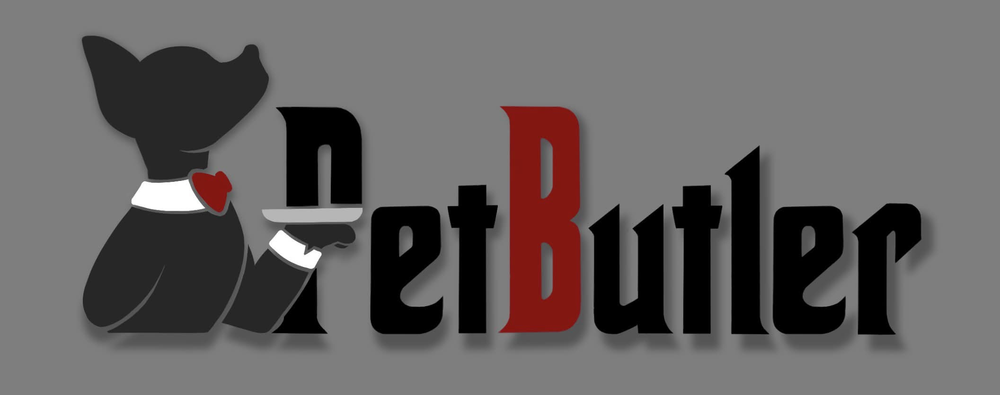

# FECAP - Fundação de Comércio Álvares Penteado

# **PetButler**

## Grupo 4

### Integrantes:
- **Leonardo Ferreira da Silva** — <a href="https://www.linkedin.com/in/leoonaardoferreira/">LinkedIn</a>
- **Sátiro Gabriel de Souza Santos** — <a href="https://www.linkedin.com/in/s%C3%A1tiro-gabriel-27081430b/">LinkedIn</a>
- **Sabrinna Cristina Gomes Vicente** — <a href="https://www.linkedin.com/in/sabrinna-vicente-049225306/">LinkedIn</a>
- **Maria Kassandra Alves Gomes** — <a href="https://www.linkedin.com/in/maria-kassandra-a-a6b406284/">LinkedIn</a>

### Professores Orientadores:
Victor Bruno Alexander Rosetti de Quiroz,  
Edson Ricardo Barbeiro,  
Lucy Mari Tabuti,  
Rodnil da Silva Moreira Lisboa,  
João Francisco Trencher Martins.

---

## 🎯 Descrição

O nosso projeto PetButler é um alimentador programável e inteligente, que além do alimentador fornece um sistema inteligente de fácil uso que conecta no celular, permitindo assim acesso de qualquer lugar, de um jeito prático e sempre na mão, mantendo sua rotina e a do seu pet na linha mesmo quando você não pode estar.
Não vemos nosso produto como um simples alimentador automático, vemos o PetButler como um ajudante na rotina dos tutores. 

Nosso projeto reflete que não buscamos apenas criar um produto, mas gerar valor real para a sociedade. Esperamos impulsionar inovação, melhorar qualidade de vida e contribuir para o desenvolvimento de soluções cada vez mais inteligentes e conectadas.

---

## 🛠 Estrutura de pastas

-Raiz 
| 
|-->documentos 
  &emsp;|-->Entrega 1 
    &emsp;|-->Inovação e Empreendedorismo 
    &emsp;|-->Sistemas Embarcados e Robótica 
    &emsp;|-->Projeto Interdisciplinar | Internet das coisas e Robótica 
    &emsp;|-->Teoria da Computação e Linguagens Formais 
    &emsp;|-->Redes de Computadores e Cibersegurança 
  &emsp;|-->Entrega 2 
    &emsp;|-->Inovação e Empreendedorismo 
    &emsp;|--Sistemas Embarcados e Robótica 
    &emsp;|-->Projeto Interdisciplinar | Internet das coisas e Robótica 
    &emsp;|-->Teoria da Computação e Linguagens Formais 
    &emsp;|-->Redes de Computadores e Cibersegurança 
  &emsp;|readme.md 
|-->src/smart_feeders 
  &emsp;|-->windows 
  &emsp;|-->android 
  &emsp;|-->HTML 
|-->imagens 
|-->src 
|.gitignore 
|readme.md 

---

## 📋 Licença/License
Este projeto está licenciado sob a licença CC BY 4.0.
Você pode criar a sua própria licença Creative Commons em: https://chooser-beta.creativecommons.org/

## 🎓 Referências

Aqui estão as referências usadas no projeto:
